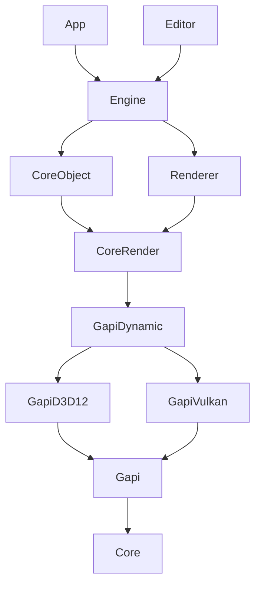

# Nene Engine

Nene Engine is an in-house game engine named after Sakura Nene's game engine in anime series [<<New Game!!>>](http://newgame-anime.com/).


## Getting Started

### Preliminary

Nene Engine uses [Vcpkg](https://vcpkg.io/) to manage dependencies, [Meson](https://mesonbuild.com/) to manage build. 

The following environments must be satisfied:

- [Working Vcpkg environment](https://learn.microsoft.com/en-us/vcpkg/get_started/get-started?pivots=shell-cmd), with `vcpkg` command available in `PATH`

- [Getting Meson](https://mesonbuild.com/Getting-meson.html) >= 1.11.0, with `meson` command available in `PATH`

The following C++ environment should be satisfied in Windows:

- Visual Studio >= 2022.17.2 [*]
- Compiler C++ Standard >= C++20 ( MSVC >= 143 )

Currently Nene Engine only supports Microsoft Windows with Direct3D 12. 
Apple's OS with Metal; Linux, Android with Vulkan will be supported in the future.

[\*] [Microsoft only supports `std::format` under C++20 after Visual Studio 17.2](https://github.com/microsoft/STL/issues/1814)


### Development

Nene Engine is built by [Meson](https://mesonbuild.com/) now. 


#### Setup

##### Visual Studio ( or Rider )

```bash
$ meson setup .build --backend=vs
```

##### Command Line

```bash
$ meson setup .build
```

##### Setup Options

The supported build types are:

- `debugoptimized`: optimized build with debug info, useful for development.
- `release`: full optimization, max performance.

For example

```bash
$ meson setup .build --backend=vs --buildtype=release
```

All available options are listed in `meson.options` file.


#### Build and Run

##### Visual Studio  ( or Rider )

Use [meson devenv](https://mesonbuild.com/Commands.html#devenv) to open `.build/NeneEngine2.sln` the IDE

```bash
$ meson devenv -C .\.build\ devenv .\NeneEngine2.sln
```

or

```bash
$ meson devenv -C .\.build\ rider .\NeneEngine2.sln
```

Then build and run ( debug ) `app` or `editor` module in the IDE.


##### Command Line

Build via. Meson command line

```bash
$ meson compile -C .build
```

The normal build produces shared libraries for engine modules and executables
for `app` and `editor`. 


Then bring the command line into [meson devenv](https://mesonbuild.com/Commands.html#devenv) interactive mode

```bash
$ meson devenv -C .build
```

Run the executable

```powershell
[NeneEngine2] PS D:\NeneEngine2\.build> .\source\app\app.exe
```


#### Module Scheme

Nene Engine organizes C++ modules as folders under `source`. Each module owns a
`meson.build` file. 

You can add or remove a module by adding or removing a folder with a `meson.build` file under `source`.


## Introduction

### Modules Dependency




### Coding Standard

#### Namespace

You can use namespaces to organize your classes, functions and variables where appropriate. But Nene Engine uses some special namespaces to annotate the category of the classes or functions:

```c++
namespace nene
{
} 
```

The namespace `nene` is the root namespace of Nene Engine.


```c++
// Template
namespace nene::t
{
    template<class somedata_t>
    class some_class_template
    {
    };
}
```

The namespace `nene::t` is for class or function templates. For example, container such as rotator ( `t::rotator<>` ), rectangle ( `t::rect<>` ) are in this namespace. 


```c++
// QtExtension
#include <QtWidgets/QWidget>
namespace nene::qt
{
	class BINDINGS_API some_qt_widget : public QWidget
    {
        Q_OBJECT
    };
}
```

The namespace `nene::qt` is for Qt extension class for editor.


## Open Source

Nene Engine cannot live without the forces of open sources. Especially the following brilliant open source libraries:

- [Pyside6](https://doc.qt.io/qtforpython-6/index.html)
- [Python3](https://www.python.org/)
- [Pybind11](https://github.com/pybind/pybind11)
- [RTTR](https://www.rttr.org/)
- [Taskflow](https://taskflow.github.io/)
- [Assimp](https://github.com/assimp/assimp)
- [NlohmannJson](https://github.com/nlohmann/json)


Huge shout out to the developers of these open source library and the brilliant brains who helped or inspired Nene Engine's development.


