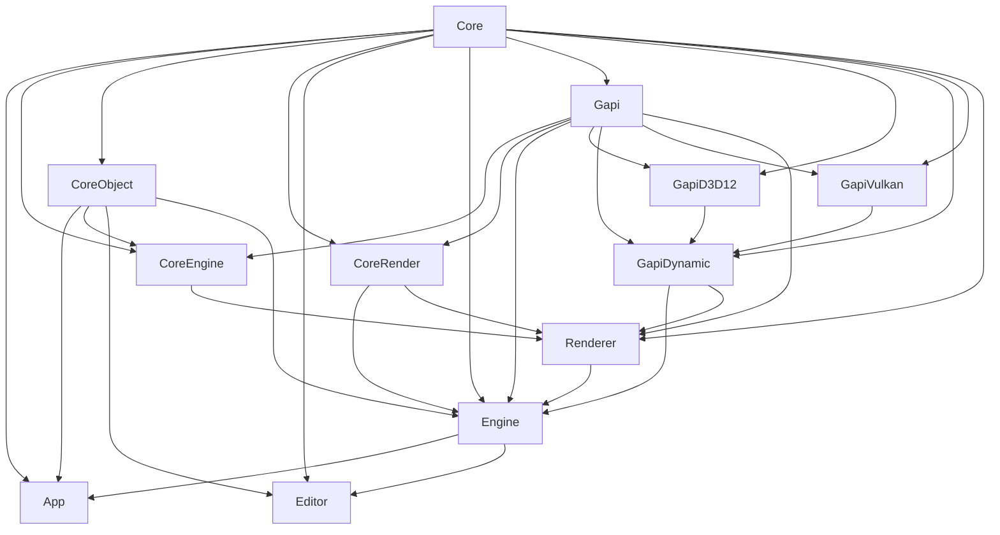

# Nene Engine

Nene Engine is an in-house game engine named after Sakura Nene's game engine in anime series [<<New Game!!>>](http://newgame-anime.com/).


## Getting Start

### Preliminary

Nene Engine use Python as main scripting language and tool-chain language. The following Python environment must be satisfied:

- Python >= 3.10
- Pyside6.9

Note that Nene Engine use Visual Studio's Project file  ( instead of CMake ) as a primary way to organize the source files. The following C++ environment should be satisfied in Windows:

- Visual Studio >= 2022.17.2 [*]
- Compiler C++ Standard >= C++20 ( MSVC >= 143 )

Currently Nene Engine only supports Microsoft Windows 10, 11 with Direct3D 12. 
Apple's MacOS, iPadOS, iOS with Metal 2; Linux, Android with Vulkan will be supported in the future.

[*] [Microsoft only supports `std::format` under C++20 after Visual Studio 17.2](https://github.com/microsoft/STL/issues/1814)


### Development

#### Build

Currently Nene Engine is built with Visual Studio. To build Nene Engine, simply  press ▶ in the IDE.


#### Build Tool

To deal with module dependency, we use a Python based custom build tool ( Nene Build Tool or NBT ) which modify the Visual Studio project and solution files.

All source of the NBT is located in `script/builder` folder, which is also the main entrance python module of NBT.

After adding, removing or modifying a module, the best way to ensure that IDE can successfully build is to run NBT once:

```bash
$ NeneEngine>: Generate.bat
```


#### Module Scheme

NBT finds the configuration of each module in `module_name.py` file.


#### Project Scheme

You can add, remove module directly in Visual Studio. Just don't forget to run NBT after doing this.


### Usage

```bash
$ NeneEngine>: Editor.bat
```


## Introduction

### Modules




### Coding Standard

#### Namespace

You can use namespaces to organize your classes, functions and variables where appropriate. But Nene Engine uses some special single letter namespaces to annotate the category of the classes or functions:

```c++
// Interface
namespace i
{
    class some_interface_class
    {
    public:
        virtual void foo() = 0;
    };
} 
```

The namespace `i` is for interface classes which have at least one pure virtual method.


```c++
// Template
namespace t
{
    template<class tsometype>
    class some_class_template
    {
    };
}
```

The namespace `t` is for class or function templates. For example, container such as vector ( `t::dynamic_array<>` ), array ( `t:static_array<>` ) are in this namespace. 


```c++
// NeneObject
#include "core_object/object.h"
namespace n
{
    class some_class : public object
    {
    };
}
```

The namespace `n` is for class that has reflection in Nene Engine. The classes in namespace `n` must inherit from `n::object` class. This give the derived classes the ability of reflection and serialization.


```c++
// QtExtension
#include <QtWidgets/QWidget>
namespace q
{
	class BINDINGS_API some_qt_widget : public QWidget
    {
        Q_OBJECT
    };
}
```

The namespace `q` is for 


## Open Source

Nene Engine cannot live without the forces of open sources. Especially the following brilliant open source library:

- [Pyside6](https://doc.qt.io/qtforpython-6/index.html)
- [Python3](https://www.python.org/)
- [Pybind11](https://github.com/pybind/pybind11)
- [RTTR](https://www.rttr.org/)
- [Taskflow](https://taskflow.github.io/)
- [Assimp](https://github.com/assimp/assimp)
- [NlohmannJson](https://github.com/nlohmann/json)


Huge shout out to the developers of these open source library and the brilliant brains who helped or inspired Nene Engine's development.


