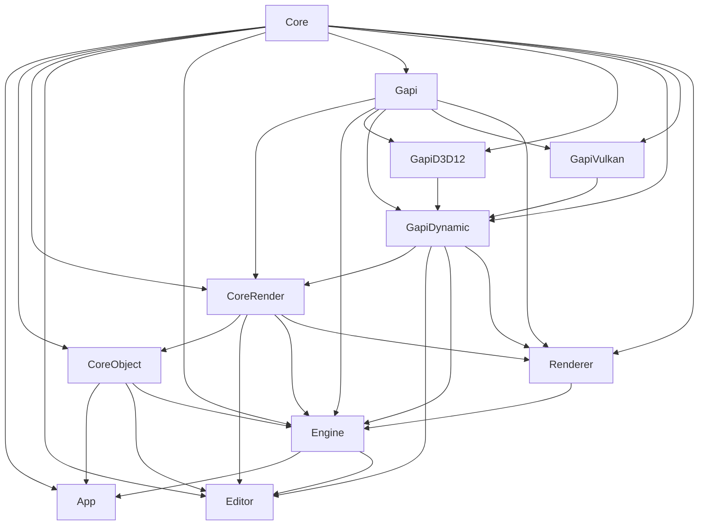

# Nene Engine

Nene Engine is an in-house game engine named after Sakura Nene's game engine in anime series [<<New Game!!>>](http://newgame-anime.com/).


## Getting Started

### Preliminary

Nene Engine use [Vcpkg](https://vcpkg.io/) to manage dependencies. The following environment must be satisfied:

- [Working Vcpkg environment](https://learn.microsoft.com/en-us/vcpkg/get_started/get-started?pivots=shell-cmd)

Note that Nene Engine use an inhouse build tool NBT  ( instead of CMake ) as a primary way to organize the source files. 

The following C++ environment should be satisfied in Windows:

- Visual Studio >= 2022.17.2 [*]
- Compiler C++ Standard >= C++20 ( MSVC >= 143 )

Currently Nene Engine only supports Microsoft Windows 10, 11 with Direct3D 12. 
Apple's MacOS, iPadOS, iOS with Metal 2; Linux, Android with Vulkan will be supported in the future.

[*] [Microsoft only supports `std::format` under C++20 after Visual Studio 17.2](https://github.com/microsoft/STL/issues/1814)


### Development

#### Setup

1. Run `Setup.bat` or `Setup.sh` and wait patiently for the first time for dependency installation.
2. Run `Generate.bat` or `Generate.sh` to generate build files of IDE.


#### Build

Open the `NeneEngine2` build file with corresponding IDE then compile and run.


#### Build Tool

To deal with module dependency, we use a Python based inhouse build tool ( Nene Build Tool or NBT ).

All source of the NBT is located in `script/builder` folder, which is also the main entrance python module of NBT.

After adding, removing or modifying a module, the best way to ensure that IDE can successfully build is to run NBT once again:

```bash
$ NeneEngine>: Generate.bat
```


#### Module Scheme

Nene Engine organize c++ module as different folders located in  `source` directory. Each c++ module folder is also a python module, so NBT will finds the configuration of each module in `__init__.py` file.

You can add, remove files in module as you want. Don't forget to re-generate build files after doing this.


#### Project Scheme

You can add, remove module by adding a folder in `source` directory. 

Then adding an `__init__py` to declare the basic information for this module, for example:

```python
# source/app/__init__.py

from source import *
from source.core import Core
from source.engine import Engine


class App(NeneModule):

	def __init__(self):
		super().__init__()
        # This module will be built into an executable, not a library
		self.build_target = BuildTarget.EXE
        # The other module that this module depends
		self.module_dependencies.extend([Core, Engine])
		pass
```


## Introduction

### Modules




### Coding Standard

#### Namespace

You can use namespaces to organize your classes, functions and variables where appropriate. But Nene Engine uses some special namespaces to annotate the category of the classes or functions:

```c++
namespace nene
{
} 
```

The namespace `nene` is the root namespace of Nene Engine.


```c++
// Template
namespace nene::t
{
    template<class somedata_t>
    class some_class_template
    {
    };
}
```

The namespace `nene::t` is for class or function templates. For example, container such as rotator ( `t::rotator<>` ), rectangle ( `t:rect<>` ) are in this namespace. 


```c++
// QtExtension
#include <QtWidgets/QWidget>
namespace nene::qt
{
	class BINDINGS_API some_qt_widget : public QWidget
    {
        Q_OBJECT
    };
}
```

The namespace `nene::qt` is for Qt extension class for editor.


## Open Source

Nene Engine cannot live without the forces of open sources. Especially the following brilliant open source library:

- [Pyside6](https://doc.qt.io/qtforpython-6/index.html)
- [Python3](https://www.python.org/)
- [Pybind11](https://github.com/pybind/pybind11)
- [RTTR](https://www.rttr.org/)
- [Taskflow](https://taskflow.github.io/)
- [Assimp](https://github.com/assimp/assimp)
- [NlohmannJson](https://github.com/nlohmann/json)


Huge shout out to the developers of these open source library and the brilliant brains who helped or inspired Nene Engine's development.


